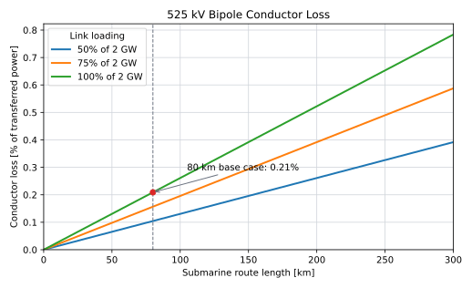

## Role and Cost Boundary

The HVDC export-cable system carries power between the offshore and onshore converter stations. This page owns cable supply and cable electrical performance. Marine and terrestrial installation are costed separately.

| Physical scope | Treatment | Cost owner |
|---|---|---|
| Positive- and negative-pole cable supply | Included here | **This page** |
| Metallic-return and communication cable supply | Included here when required by the selected topology | **This page** |
| Cable accessories supplied with the system | Included here when included in the material benchmark | **This page** |
| Marine laying, burial, protection and pull-in | Excluded | [Cable and Pipeline Installation](../offshore_installation/cable_and_pipeline_installation.qmd) |
| Underground trenching, ducts and reinstatement | Excluded | [Cable and Pipeline Installation](../offshore_installation/cable_and_pipeline_installation.qmd) |
| Exceptional crossings, tunnels and rock placement | Excluded | [Cable and Pipeline Installation](../offshore_installation/cable_and_pipeline_installation.qmd) |
| Converter stations | Excluded | [HVDC Converter Stations](hvdc_converter_stations.qmd) |

Green = booked on this page
Grey = reference only; not booked on this page

A **route-kilometre** measures one kilometre of corridor. A **cable-kilometre** measures one kilometre of one manufactured cable. Complete-system route benchmarks must not be multiplied again by the number of pole and return cables.

## Reference Cable System

The TenneT  reference system uses a positive-pole cable, negative-pole cable, dedicated metallic-return cable and fibre-optic cable [@tennet2024TwoGWProgram; @tennet2025TwoGWStandard].

| Parameter | Reference value |
|---|---:|
| HVDC topology | Bipole with dedicated metallic return |
| Pole voltage | +/- |
| Full-load pole current |  |
| TenneT programme route range | 150--300 km |
| Procurement conductor options | 2,300 or 2,500 mm2 Cu; 3,100 mm2 Al |
| Indicative copper resistance |  at 20 degrees C |
| Indicative 2,500 mm2 cable diameter | About 160 mm |
| Indicative mass | About 65 kg/m per cable |

The conductor options and programme route range come from TenneT [@tennet2024TwoGWProgram]. The resistance, diameter and mass are indicative Prysmian data [@prysmian525KVSubmarine], not a selected project design.

## Electrical-Loss Model

For two pole conductors of equal resistance:

$$
P_\mathrm{cable,loss}
=
2I_\mathrm{pole}^{2}R'L,
$$

and:

$$
\frac{P_\mathrm{cable,loss}}{P_\mathrm{dc}}
=
\frac{I_\mathrm{pole}R'L}{V_\mathrm{pole}}.
$$

Using  at 20 degrees C and
 gives:

| Route length | Conductor loss | Share of 2 GW |
|---:|---:|---:|
| 80 km |  |  |
| 150 km |  |  |
| 250 km |  |  |
| 300 km |  |  |

{#fig-hvdc-loss-distance}

The calculation excludes joints, terminations, operating-temperature effects, return-current imbalance and converter losses. Annual cable loss should be calculated from the time series:

$$
E_\mathrm{cable,loss}
=
\sum_t2I(t)^2R'(T_t)L\,\Delta t.
$$

The current fixed  efficiency is only a legacy near-shore approximation. With the illustrative resistance, conductor loss alone reaches 0.5% at about  at 20 degrees C. Distance studies should therefore use the load-dependent calculation and remove the fixed deduction.

## Cable-Supply Cost

### Separated Public Reference

The NREL Atlantic Offshore Wind Transmission Study gives a separated material cost of  for a ,  HVDC bipole and states that installation is added separately [@brinkman2024AtlanticTransmission]. Converted with the ECB 2025 annual-average exchange rate, the material reference is , or  at  [@ecb2025USDEUR].

| Cable-supply element | Unit value | Status | Cost owner |
|---|---:|---|---|
| ,  bipole material reference |  | NREL material cost converted with the 2025 ECB average exchange rate | **This page** |
| Marine/terrestrial installation | Calculated separately | Shared campaign model; no fixed EUR/km coefficient is adopted | [Cable and Pipeline Installation](../offshore_installation/cable_and_pipeline_installation.qmd) |

This is a currency conversion, not a price-year escalation. The NREL source price basis remains to be confirmed before the value can be adopted as a constant-EUR~2025~ model input.

## Installed-Cost Perspective

The background report's Adriatic Link and DEA values cover installed or EPC cable systems. They are useful checks on the combined supply-plus-installation result but cannot be assigned wholly to cable material.

| Installed-system benchmark | Reference value | Interpretation | Cost owner |
|---|---:|---|---|
| NREL material + installation | EUR 4.00 million/km | Historical 2 GW installed-route comparison; not an adopted installation coefficient | This page and [Cable and Pipeline Installation](../offshore_installation/cable_and_pipeline_installation.qmd) |
| Adriatic-derived subsea rate | EUR~2025~ 2.52 million/km | Installed-system inference from a 1 GW project | [Cable and Pipeline Installation](../offshore_installation/cable_and_pipeline_installation.qmd) |
| DEA subsea EPC reference | EUR~2025~ 7.90 million/km | DEA value restated to EUR~2025~ and evaluated at 2 GW | [Cable and Pipeline Installation](../offshore_installation/cable_and_pipeline_installation.qmd) |

::: {.callout-note}
## Installation is shown for perspective only

Installed-system comparisons are shown here only to give the cable-supply result a complete-route context. Installation is calculated through the physical inventory and campaign model on [Cable and Pipeline Installation](../offshore_installation/cable_and_pipeline_installation.qmd). Only the green material reference belongs to this page.
:::

The Adriatic anchor is not topology-identical to the TenneT reference: Prysmian describes two submarine and two underground power cables, whereas TenneT adds a dedicated metallic return and fibre [@prysmian2023AdriaticLink]. The comparison is therefore indicative rather than a matched 2 GW quotation.

## Reliability and Repair

The legacy model assigns  cable availability. Actual energy unavailability depends on route exposure, fault frequency, repair duration and whether a fault removes one pole or the complete corridor.

ENTSO-E and Europacable report an indicative historical cable-system failure rate of about 0.07 faults per 100 km-year and average submarine repair duration of about 60 days [@entsoeEuropacable2019Reliability]. These historical values are not guarantees for a new 525 kV system.

| Cable state | Available transfer | Treatment |
|---|---:|---|
| Both poles healthy |  | Normal operation |
| One pole unavailable, return healthy | Approximately  | Count half-capacity exposure |
| Common corridor or both poles unavailable | 0 GW | Count full-capacity exposure |

Spare cable, compatible joints, repair-vessel access, permits and trained jointing teams affect outage duration. Their costs belong to the installation/OPEX boundary; the resulting energy loss belongs to the availability model.

## Current Assumptions

| Parameter | Base case | Sensitivity or next step | Evidence status |
|---|---:|---:|---|
| Link rating |  reference | Test multiple links | Public TenneT standard |
| Pole voltage | +/- | Fixed for reference design | Public TenneT standard |
| Cable material CAPEX |  | Confirm source price year and escalate consistently | NREL reference converted at 2025 ECB average |
| Installation CAPEX | Excluded from this page | Use linked installation model | Separate cost owner |
| Cable loss | Hourly $I^2R(T)L$ preferred |  only for legacy compatibility | Engineering model |
| Flat cable availability |  | Replace with capacity states | Internal convention |
| Cable OPEX | TBD | Define inspection, spares and repair scope | Separate evidence required |

## Model Limitations

| Limitation | Implication |
|---|---|
| NREL source price year is unresolved | The euro conversion is not yet a constant-EUR~2025~ input |
| NREL and TenneT topologies may differ | Metallic-return and accessory scope must be checked |
| Adriatic and DEA values include installation | They validate only the combined route cost |
| No matched underground material coefficient | Subsea and underground supply costs cannot yet be separated cleanly |
| One indicative copper resistance is used | Aluminium and operating-temperature alternatives are absent |
| Fixed 99.5% efficiency is retained only for compatibility | It is not valid across the full route range |
