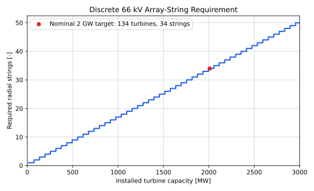

## Role and Scope

Infield, inter-array or array cables form the medium-voltage collection network inside the wind farm. Each radial string carries the output of several turbines to an offshore AC bus. The cables are used by both the electricity-export and centralised-hydrogen architectures; decentralised hydrogen replaces the main array network with hydrogen pipelines.

| Included on this page | Accounted elsewhere |
|---|---|
| Static three-core 66 kV submarine cable | Turbine step-up transformer and switchgear |
| Cable conductor sizing and string capacity | 66 kV offshore switchgear bays |
| Joints, terminations and cable accessories in the cable supply scope | Offshore platform and J-tubes |
| Horizontal and vertical cable length | Cable-lay vessel and installation campaign |
| String-level outage effect | Export cable and onshore connection |

This page covers cable supply only. Cable-lay vessels, route preparation, burial, pull-ins and other installation activities are costed separately on [Cable and Pipeline Installation](../offshore_installation/cable_and_pipeline_installation.qmd).

::: {.callout-note}
## Physical picture: a radial electrical tree

An array string is comparable to a daisy chain. The first cable segment carries one turbine's output; each following segment carries that turbine plus every turbine farther from the substation. The final segment into the offshore bus therefore carries the greatest current and usually needs the largest conductor.

The reference design is **radial**: there is one normal path from each turbine to the substation. This is simple and economical, but a fault near the root of a string can disconnect all turbines downstream of it. A ring or meshed network could provide another path, at the cost of more cable and switchgear.
:::

## Why 66 kV Is the Reference Voltage

Moving from 33 kV to 66 kV approximately doubles the transferable power at the same current. That allows more turbine capacity per string, fewer strings and fewer offshore-platform entries. Carbon Trust estimated that the transition could reduce offshore-wind LCOE by about 1.5%, and DNV GL's TenneT study found a material reduction in cable length for the Dutch Borssele concept [@carbonTrust2014SixtySixKV; @dnvgl2015SixtySixKV].

The technology is now demonstrated at commercial scale. Borssele 1 and 2 used three-phase 66 kV copper array cables in two cross-sections over roughly 170–190 km [@nexans2018Borssele66KV]. Fixed 66 kV-class submarine cables fall within the scope of IEC 63026, while project design must also address offshore-specific interfaces, installation and mechanical loading [@iec63026; @dnvST0359].

66 kV should nevertheless be treated as the **current reference**, not a permanent optimum. Carbon Trust's later high-voltage-array work considers 132 kV as turbine and plant ratings grow; it reported modelled savings of GBP 32–50 million for a 1,200 MW future plant relative to an equivalent 66 kV system [@carbonTrust2022HighVoltageArrays].

## Cable Construction

A typical fixed-bottom array cable contains:

- three copper or aluminium phase conductors;
- conductor screens and cross-linked polyethylene (XLPE) insulation;
- metallic screens and water-blocking layers;
- fibre-optic elements for communication and monitoring;
- fillers, bedding and one or more armour layers; and
- an outer serving that protects the cable during handling and installation.

Cable cross-section normally increases toward the offshore substation because each successive segment carries the power of more downstream turbines. A screening model can use one usable string rating, but an optimised design uses at least two or three conductor sizes.

## Public Reference Cable Data

The current NREL ORBIT input set provides two transparent 66 kV screening anchors at 2 m burial:

| Conductor cross-section | Rated current | Approximate three-phase capacity at unity power factor | Cable mass | ORBIT cable unit cost |
|---:|---:|---:|---:|---:|
| 185 mm² | 445 A | 50.9 MVA | 26.1 t/km | 219 EUR~2025~/m |
| 630 mm² | 775 A | 88.6 MVA | 42.5 t/km | 590 EUR~2025~/m |

The source values are USD 241,542/km and USD 650,000/km in 2024 dollars [@orbit2026Cable185; @orbit2026Cable630]. They are normalised to EUR~2025~ using the 2024 and 2025 annual-average U.S. CPI-U indices and the ECB 2025 annual-average exchange rate, following [Financial and Price-Basis Assumptions](../methodology/financial_and_price_basis.qmd) [@bls2024CPI; @bls2025CPI; @ecb2025USDEUR]. ORBIT states that its updated cost rates use industry outreach together with commodity-price, inflation and labour-index adjustments [@orbit2026Changelog]. They remain planning-model inputs rather than a supplier quotation. No additional manufacturer markup is applied because the ORBIT values already represent cable procurement unit costs. Installation is excluded.

TenneT's Dutch interface study used a nominal maximum of 630 A, equivalent to about 72 MVA at 66 kV. With reactive-power duty and a 0.9 power factor, it treated approximately 64–66 MW as usable active power per connection [@tennet2015JTubes]. This range is used as the screening string rating on this page.

Three ratings should not be confused:

- **ampacity** is the maximum continuous current the installed cable can carry without exceeding its allowable conductor temperature;
- **MVA capacity** follows mainly from voltage and current; and
- **MW capacity** is the active-power share after power factor, reactive duty and engineering derating are allowed for.

A 72 MVA cable does not automatically provide 72 MW of usable wind-power transfer.

## String Capacity Model

For target farm capacity $P_\mathrm{target}$ and turbine rating $P_\mathrm{turb}$, the installed turbine count and capacity are:

$$
N_\mathrm{turb}
=
\left\lceil
\frac{P_\mathrm{target}}{P_\mathrm{turb}}
\right\rceil,
\qquad
P_\mathrm{farm}
=
N_\mathrm{turb}P_\mathrm{turb}.
$$

For a selected usable string rating, the number of full turbines that fit on one radial string is:

$$
n_\mathrm{turb/string}
=
\left\lfloor
\frac{P_\mathrm{string}}{P_\mathrm{turb}}
\right\rfloor,
$$

and the minimum number of strings is:

$$
n_\mathrm{string}
=
\left\lceil
\frac{N_\mathrm{turb}}{n_\mathrm{turb/string}}
\right\rceil.
$$

The floor operator in the first equation prevents a fraction of a turbine being assigned to a string. The ceiling operator in the second ensures that a partly filled final string still receives a complete cable, switchgear bay and platform termination. These discrete jumps are why a small change in turbine or string rating can create a noticeable CAPEX step.

This is the same basic capacity logic used by NREL's ORBIT model [@nunemaker2020ORBIT]. Final cable selection must also check voltage drop, short-circuit duty, charging current, burial depth, seabed thermal resistivity, conductor temperature, armour losses and post-installation protection.

::: {.callout-note}
## Worked example: 15 MW turbines

Four 15 MW turbines place 60 MW on a string. Five place 75 MW on it and exceed the 64–66 MW screening range. A nominal 2 GW target therefore requires 134 turbines, giving 2.01 GW installed and:

$$
n_\mathrm{string}=\left\lceil\frac{134}{4}\right\rceil=34.
$$
:::

@fig-array-string-count shows the resulting discrete string count. A small increase in plant capacity can require a complete additional feeder, switchgear bay, J-tube, pull-in and cable route.

{#fig-array-string-count}

::: {.callout-warning}
## The worked array does not fit the reference platform unchanged

TenneT's 2 GW reference arrangement shows 24 dedicated wind-farm bays plus four universal bays [@tennet2024TwoGWProgram]. The 34-string worked case therefore needs at least six more terminations than the maximum 28 shown, even if every universal bay is assigned to a feeder. A consistent design must do one or more of the following:

- adopt a cable and platform interface rated for at least 75 MW per string, so five 15 MW turbines fit and only 27 strings are required;
- add offshore feeder aggregation or another switchgear interface;
- move to a higher collection voltage; or
- use a project-specific platform layout with more bays.

This interface constraint must be solved before the 34-string cable count and standard 2 GW platform are combined in one cost case.
:::

## Cable-Length Model

Cable length is calculated from the modelled turbine layout and radial-string topology. Capacity determines the number of turbines and strings; rotor diameter and spacing determine their separation; farm area, aspect ratio and substation position constrain the coordinates. This keeps cable length responsive when any of those design inputs change.

For rotor diameter $D$ in metres and along-string and cross-string spacings $s_x$ and $s_y$ in rotor diameters, the physical spacings are:

$$
d_x=\frac{s_xD}{1000},
\qquad
d_y=\frac{s_yD}{1000},
$$

where $d_x$ and $d_y$ are in kilometres. The wind-layout model places $N_\mathrm{turb}$ turbines inside the farm boundary using these spacings and returns turbine coordinates $(x_j,y_j)$. The gross farm area $A_\mathrm{farm}$, spacing and turbine count are not independent: the selected coordinates must satisfy both the minimum-spacing rules and the site boundary. The model must flag an infeasible combination rather than silently rescale the spacing.

For an ideal rectangular grid with $n_x$ turbine positions along the wind direction and $n_y$ across it, where $n_xn_y\geq N_\mathrm{turb}$, the occupied grid spans are:

$$
W_\mathrm{grid}=(n_x-1)d_x,
\qquad
H_\mathrm{grid}=(n_y-1)d_y.
$$

These spans, together with boundary margins and exclusions, must fit inside $A_\mathrm{farm}$. Farm area is therefore a geometric constraint, not an additional cable-length multiplier. A larger boundary changes cable length only when the layout actually spreads the turbine coordinates farther apart.

The string-capacity calculation above partitions the turbines into radial strings with no more than $n_\mathrm{turb/string}$ turbines. Let $\mathcal{E}$ be the resulting set of cable connections: one connection from the offshore substation to the first turbine on each string, followed by turbine-to-turbine connections. The horizontal distance of connection $(u,v)$ is:

$$
d_{uv}
=
\sqrt{(x_u-x_v)^2+(y_u-y_v)^2}.
$$

Total pre-route horizontal cable length is therefore:

$$
L_\mathrm{horizontal}
=
\sum_{(u,v)\in\mathcal{E}}d_{uv},
$$

and the screening supply length is:

$$
L_\mathrm{array}
=
(1+r)L_\mathrm{horizontal}
+
L_\mathrm{pull\text{-}in},
$$

where $r$ is the route allowance and $L_\mathrm{pull\text{-}in}$ is the separately calculated total cable length between seabed touchdown points and turbine or platform terminations. No default pull-in length is inserted until the water-depth and interface assumptions are defined.

This is the same calculation structure used by ORBIT's grid-array model: turbine and row spacing define coordinates, cable capacity limits turbines per string, and the model sums the Euclidean distance between successive connection points [@nunemaker2020ORBIT].

### Validation against public projects

Published project quantities are used to test the model output, not to replace the physical calculation:

| Project | Turbines | Reported array cable | Derived length per turbine |
|---|---:|---:|---:|
| Borssele 1 & 2 | 94 | 170–190 km | 1.81–2.02 km/turbine |
| Moray East | 100 | 200 km | 2.00 km/turbine |
| Hornsea 2 | 165 | 373 km | 2.26 km/turbine |
| Dogger Bank A | 95 | More than 328 km | More than 3.45 km/turbine |

The inputs come from cable suppliers and project owners [@nexans2018Borssele66KV; @jdr2020MorayEast; @orsted2021Hornsea2; @equinorDoggerBankAArray]. BOEM's review of submitted US construction and operations plans gives an additional portfolio average of 1.48 miles, or approximately 2.4 km, of inter-array cable per wind-turbine foundation [@boem2022MaximumCase].

These ratios span different turbine ratings, site shapes, substation positions and reporting scopes. Supplied quantities can also contain project allowances or spare cable. They therefore define a validation range rather than a universal coefficient. For each modelled case, report $L_\mathrm{array}/N_\mathrm{turb}$ beside these benchmarks and investigate an out-of-range result before using its cost.

::: {.callout-warning}
## Routing allowance is not universal

The current 20% addition comes from the internal model description [@internalModelDescription2026]. It should not be added on top of coordinates or route lengths that already include bends, exclusions and slack. Use 5–20% only as a pre-route sensitivity.
:::

## Cost Model

The screening cost on this page covers cable material and normal supply accessories. Installation is excluded and belongs to [Cable and Pipeline Installation](../offshore_installation/cable_and_pipeline_installation.qmd).

For supply length $L_\mathrm{array}$ in kilometres and blended cable unit cost $c_\mathrm{cable}$ in EUR~2025~/m:

$$
C_\mathrm{supply}
=
1000L_\mathrm{array}c_\mathrm{cable}.
$$

The following evidence brackets the screening unit cost:

| Benchmark | Scope and price basis | Derived unit cost |
|---|---|---:|
| ORBIT 185 mm², 66 kV | Cable procurement input, 2024 USD normalised to EUR~2025~ | 219 EUR~2025~/m |
| ORBIT 630 mm², 66 kV | Cable procurement input, 2024 USD normalised to EUR~2025~ | 590 EUR~2025~/m |
| Hollandse Kust Zuid III & IV | Approximately EUR 30 million for design, testing and supply of 172 km of 66 kV cable and accessories, 2019 nominal | Approximately 174 EUR/m |

Prysmian reports the 172 km supply scope and its annual report gives the approximately EUR 30 million contract value [@prysmian2019HollandseKustZuid; @prysmian2019AnnualReport]. The project average combines cable sizes and is not a direct quotation for the largest conductor.

The base case remains **400 EUR~2025~/m**, with **200–600 EUR~2025~/m** used as an engineering sensitivity. This is a blended screening assumption between a historical mixed-cable contract and the current ORBIT conductor-specific inputs; it is not a statistical mean or a supplier quotation. No manufacturer markup is added. A conductor-by-conductor cost calculation should replace the blended rate only when the routed string design identifies the length of each cable size.

## OPEX Allowance

Public evidence describes large but infrequent cable failures more clearly than it reports expected annual cable-only expenditure. ORE Catapult's SPARTA portfolio found cable outages in 7.46% of wind-farm months and in 61% of reporting wind farms, with outage days split approximately equally between array and export cables [@oreCatapult2022SPARTA]. Its ELECTRODE programme reports an average repair duration of about two months and consequences often above GBP 10 million, but that amount combines repair expenditure and lost generation [@oreCatapult2023ELECTRODE].

These data do not provide an array-only annual failure frequency or a clean split between physical repair cost and lost revenue. An event-based OPEX model is therefore not used. The current relationship is retained as a top-down risk allowance:

$$
C_\mathrm{OPEX}
=
f_\mathrm{OPEX}C_\mathrm{supply},
$$

with $f_\mathrm{OPEX}=2\%$/year and a 1–3% sensitivity. At the base cable price, each 100 km of supplied cable has EUR~2025~ 40 million supply CAPEX and therefore a EUR~2025~ 0.8 million annual allowance. The allowance represents inspection and physical repair provision only. Lost generation remains in the availability calculation and must not also be included in OPEX.

## Reliability and Availability

The current model applies **99.0% array-network availability** as a flat annual yield multiplier. A radial string fault normally disconnects the turbines downstream of the fault rather than the complete wind farm, so the flat multiplier does not represent topology explicitly.

No more detailed failure model is introduced until consistent array-specific failure frequency, repair duration and affected-capacity data are available. When those inputs exist, the radial connections $\mathcal{E}$ defined by the cable-length model can also define the turbines isolated by each fault. Until then, 99.0% remains a transparent aggregate assumption rather than a calculated reliability result.

## Current Assumptions and Sensitivities

| Parameter | Base case | Suggested sensitivity | Interpretation |
|---|---:|---:|---|
| Array voltage | 66 kV | 66 or 132 kV | 132 kV is an emerging future-plant option |
| Usable string rating | 64–66 MW | Project-specific | TenneT screening range; final rating requires cable and interface checks |
| Turbine rating | 15 MW | Model variable | Four turbines per base-case string |
| Rotor diameter and turbine spacing | Wind-layout inputs | Layout scenarios | Converted into explicit turbine coordinates |
| Farm area and aspect ratio | Wind-layout inputs | Site scenarios | Constrain the feasible coordinate layout |
| Cable material cost | 400 EUR~2025~/m | 200–600 EUR~2025~/m | Blended engineering range, not a statistical confidence interval |
| Route addition | 20% | 5–20% | Apply only before a routed design exists |
| Flat availability | 99.0% | Replace with string outage states | A fault normally removes partial capacity |
| OPEX risk allowance | 2% of supply CAPEX/year | 1–3% | Physical inspection and repair provision; excludes lost generation |

## Architecture Applicability

For electricity export, the strings terminate on the integrated offshore AC/HVDC platform. For centralised hydrogen, the same array network terminates at the central electrolyser facility, but the downstream transformer and rectifier belong to the electrolyser power-electronics scope. Decentralised hydrogen removes the main 66 kV collection network from the energy path.

## Model Limitations

| Limitation | Implication |
|---|---|
| One usable MW rating represents several conductor sizes | Procurement does not yet benefit from tapered strings |
| The 34-string base case exceeds the reference platform bay count | Cable and platform designs are not yet a physically closed system |
| Idealised coordinates and string assignment replace a routed design | Exclusions, crossings and detailed approach routes remain approximate |
| Pull-in length has no default input | Supply length remains incomplete until water depth and interface geometry are defined |
| Public project cable quantities have inconsistent reporting scopes | Length per turbine is a validation range, not a calibration coefficient |
| Electrical losses are unresolved | No flat loss deduction is applied until a defensible load-dependent model is available |
| Flat 99% availability | String-level and common-mode outage states are hidden |
| Supply benchmarks mix 2019 nominal EUR and 2024 USD inputs | The apparent precision of the blended EUR/m assumption exceeds source quality |
| OPEX is a top-down percentage | Public evidence does not yet support an array-only event-frequency and cash-repair model |
| Fixed-bottom static cable is assumed | Floating-wind dynamic sections and fatigue design are outside scope |
| 66 kV is fixed in the base model | The potential value of 132 kV for 20 MW-class turbines is not optimised |
