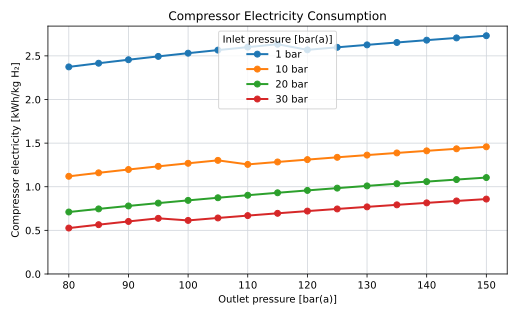
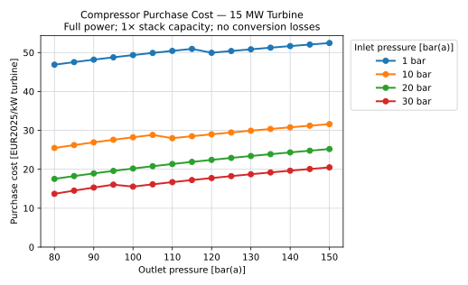

## Role and Scope

The hydrogen compressor raises the pressure of produced hydrogen from the PEM electrolyser outlet pressure to the pressure required by the hydrogen pipeline system.

The compressor is modelled explicitly because the pipeline injection pressure is a decision variable in this research. The model must therefore capture how compressor energy consumption and compressor cost change when the selected outlet pressure changes. This is necessary for the pressure-diameter optimisation of the hydrogen pipeline system.

Compression is included only in the hydrogen architectures. In the centralised architecture, compression takes place on the offshore electrolysis platform before injection into the export pipeline. In the decentralised architecture, compression takes place at turbine level before injection into the infield hydrogen pipeline.

The compressor model includes compressor electricity consumption, motor losses, CAPEX, OPEX and availability. It excludes electrolyser stack costs, electrolyser BOP, hydrogen drying, pipeline CAPEX, pipeline pressure drop and onshore recompression.

::: {.callout-note}
## Why Outlet Pressure Is Modelled Explicitly

The compressor outlet pressure is the pipeline injection pressure, one of the optimisation variables in this research. Raising it trades cheaper, higher-capacity pipeline transport against a larger compressor energy and CAPEX penalty; see [Pipeline Pressure and Capacity](pipeline_pressure_and_capacity.qmd) for how that trade-off plays out against pipeline diameter, pipeline count, and installation cost.

A fixed compressor energy value would hide that trade-off from the optimisation. This page therefore develops explicit compressor energy and cost models as a function of inlet pressure, outlet pressure, and hydrogen mass flow, so that the optimisation has something to weigh the pipeline side against. See [Compression Energy](#compression-energy) and [Cost Model](#cost-model) below.
:::

## Key Assumptions {#sec-compressor-pem}

Inlet and outlet pressures are scenario inputs. All pressures on this page are **absolute**, in bar(a); gauge inputs are converted with the standard atmosphere, , before use. The illustrated reference duty is separate from the article case: its 30 bar inlet is an absolute illustrative value, whereas the [article reference case](../research_articles/turbine_level_hydrogen/reference_case.qmd) specifies a 30 bar(g) stack outlet,  bar(a). Pressure and diameter sensitivity runs use the same energy and cost equations.

| Parameter | Value |
|---|---:|
| Electrolyser outlet pressure (illustrative) | (a) |
| Pipeline injection pressure | Decision variable |
| Typical pressure range | 80-150 bar(a) |
| Maximum pressure ratio per stage |  |
| Hydrogen specific heat ratio, $\gamma$ |  |
| Gas temperature, $T$ |  |
| Compressor efficiency, $\eta_\mathrm{comp}$ |  |
| Motor efficiency, $\eta_\mathrm{motor}$ |  |
| Compressor availability | TODO: adopt non-overlapping architecture-specific scope |
| Compressor OPEX | TODO: adopt component allowance |
| Compressor cost scaling exponent |  |
| Cost-curve reference motor input |  (normalisation choice; not a compressor design rating) |
| Maximum motor input per train |  |

: Main compressor assumptions.

The important driver is the **pressure ratio**, not the absolute pressure difference. Compressing hydrogen from 30 bar to 150 bar has a pressure ratio of 5. Compressing from 1 bar to 150 bar has a pressure ratio of 150. This is why the relatively high outlet pressure of PEM electrolysers is important for offshore hydrogen systems.

## Compression Energy

The number of compression stages is determined from the maximum allowable pressure ratio per stage:

$$
N =
\left\lceil
\frac{\ln(p_\mathrm{out}/p_\mathrm{in})}
{\ln(r_\mathrm{max})}
\right\rceil
$$

where $r_\mathrm{max}$ is the maximum stage ratio, . The worked example below uses the illustrative reference duty from (a) to (a).

The actual pressure ratio per stage is:

$$
r_s =
\left(
\frac{p_\mathrm{out}}{p_\mathrm{in}}
\right)^{1/N}
$$

For the reference case of compression from 30 bar to 150 bar:

$$
\frac{p_\mathrm{out}}{p_\mathrm{in}}
=
\frac{150}{30}
=
5
$$

This gives:

$$
N =
\left\lceil
\frac{\ln(5)}{\ln(3.3)}
\right\rceil
=
2
$$

and:

$$
r_s = 5^{1/2} = 2.24
$$

The compressor shaft work per kg of hydrogen is calculated as:

$$
w_\mathrm{shaft} =
\frac{
N \gamma Z_\mathrm{avg} R T
}{
(\gamma - 1) M_\mathrm{H_2} \eta_\mathrm{comp}
}
\left[
r_s^{(\gamma - 1)/\gamma} - 1
\right]
$$

where $Z_\mathrm{avg}$ is the average hydrogen compressibility factor between inlet and outlet pressure, evaluated from real-gas hydrogen properties via CoolProp at the arithmetic mean of $p_\mathrm{in}$ and $p_\mathrm{out}$. The [pipeline capacity model](hydrogen_pipelines.qmd) uses its own average-pressure relation; neither calculation assumes an ideal gas.

The electrical energy consumption of the compressor is:

$$
e_\mathrm{comp} =
\frac{
w_\mathrm{shaft}
}{
\eta_\mathrm{motor} \cdot 3.6 \cdot 10^6
}
$$

where $e_\mathrm{comp}$ is expressed in kWh/kg H₂.

The compressor power demand is then calculated from the hydrogen mass flow rate:

$$
P_\mathrm{comp}
=
e_\mathrm{comp}
\cdot
\dot{m}_\mathrm{H_2}
$$

where $P_\mathrm{comp}$ is in kW when $e_\mathrm{comp}$ is in kWh/kg H₂ and $\dot{m}_\mathrm{H_2}$ is in kg/h.

For annual or time-step calculations, total compressor electricity use is:

$$
E_\mathrm{comp}
=
e_\mathrm{comp}
\cdot
m_\mathrm{H_2}
$$

This energy use is treated as a parasitic load in the hydrogen system.

### Sensitivity to Outlet Pressure

Compressor energy consumption increases with outlet pressure because the relevant quantity is the pressure ratio:

$$
\frac{p_\mathrm{out}}{p_\mathrm{in}}
$$

The same outlet pressure can therefore have very different compression penalties depending on electrolyser outlet pressure. Compression to 150 bar is a relatively modest duty when hydrogen leaves the PEM electrolyser at 30 bar, but a much larger duty if hydrogen is produced near atmospheric pressure.

@fig-compressor-energy shows $e_\mathrm{comp}$ across the 80-150 bar outlet-pressure range used elsewhere in the model, for electrolyser outlet pressures of 1, 10, 20 and 30 bar.

{#fig-compressor-energy}

The curves confirm why PEM outlet pressure matters: at a given pipeline injection pressure, compressing from 1 bar takes roughly three to four and a half times the electricity of compressing from 30 bar, because it is the pressure *ratio* that drives compression work, not the absolute pressure difference. Each curve also shows small kinks rather than a smooth rise. These come from the discrete number of compression stages, $N$: as outlet pressure increases, $N$ occasionally steps up to keep the per-stage pressure ratio within its  limit, and each step changes the slope of the curve.

## Cost Model

The compressor cost model is based on the Transition Accelerator technical brief on hydrogen compression [@transitionAcceleratorCompressorCost]. Its high-flow pipeline-compressor correlation gives **uninstalled** cost as $3{,}083.3\,(P_\mathrm{comp}/\mathrm{kW})^{0.8335}$ in 2019 Canadian dollars, where $P_\mathrm{comp}$ is electrical motor input in kW. The brief's installation factor of 2 is separate and is not included in the compressor purchase cost on this page. Applicability of that high-flow equipment class to small turbine-level duties still needs checking.

After source-year escalation and currency conversion, let $A$ [EUR~2025~] be the coefficient of that same uninstalled power law and let $\alpha$ be the sourced exponent. The model uses:

$$
C_\mathrm{comp}
=
C_\mathrm{comp,ref}
\left(
\frac{P_\mathrm{comp}}
{P_\mathrm{comp,ref}}
\right)^\alpha,
\qquad
P_\mathrm{comp,ref}=15\,\mathrm{kW},
\qquad
C_\mathrm{comp,ref}=A\,15^\alpha.
$$

The agreed 15 kW reference is a convenient normalisation, **not** an independently priced compressor or a minimum motor size. Because its cost is derived from the same power law, substitution gives $C_\mathrm{comp}=A(P_\mathrm{comp}/\mathrm{kW})^\alpha$: the reference power cancels and its numerical choice has **no effect on any calculated cost**. Rounding $C_\mathrm{comp,ref}$ independently would break this equivalence. The exponent is below one, so larger compressors are cheaper per kW than smaller compressors; this affects the centralised and turbine-level train comparison, whereas the reference point does not.

### Normalisation to EUR~2025~

The brief's 2019 Canadian-dollar values are themselves converted from US-dollar HDSAM data: escalated with CEPCI and converted at 0.75 US\$/C\$, the 2019 average [@transitionAcceleratorCompressorCost, Table 4.1]. The model therefore reverses that stated conversion to recover the 2019 US-dollar basis. It then escalates in US dollars with the producer price index for air and gas compressor manufacturing, and converts at the common 2025 rate (see [Financial and Price-Basis Assumptions](../methodology/financial_and_price_basis.qmd)):

$$
A=a_{\mathrm{CAD},2019}\;x_{\mathrm{USD/CAD},2019}\;
\frac{I_{\mathrm{PPI}}(2025)}{I_{\mathrm{PPI}}(2019)}\;
\frac{1}{FX_{\mathrm{USD/EUR},2025}}.
$$

| Symbol | Meaning | Value |
|---|---|---:|
| $a_{\mathrm{CAD},2019}$ | Source coefficient of the uninstalled power law, motor input in kW [@transitionAcceleratorCompressorCost] |  |
| $x_{\mathrm{USD/CAD},2019}$ | The brief's own 2019 exchange rate [@transitionAcceleratorCompressorCost] |  |
| $I_{\mathrm{PPI}}(2025)/I_{\mathrm{PPI}}(2019)$ | Ratio of annual averages of the monthly index, 371.164 / 241.933 [@blsPpiAirGasCompressors2026] |  |
| $FX_{\mathrm{USD/EUR},2025}$ | Common 2025 annual-average rate [@ecb2025USDEUR] |  USD/EUR |
| $A$ | Coefficient in EUR~2025~ |  |
| $C_\mathrm{comp,ref}$ | Reference purchase cost, $A\,15^\alpha$, derived in code without rounding |  ( of motor input) |

: Normalisation of the compressor cost correlation.

Escalating the Canadian-dollar figure with a Canadian index and converting from Canadian dollars would apply Canadian price and exchange-rate movements to US equipment data; the chosen route keeps the index in the market of the underlying data, as the price-basis convention prefers. The index covers US producer prices for all air and gas compressor manufacturing, not hydrogen compressors specifically. The installation factor of 2 remains excluded; installation is costed separately.

### Applicability to the Evaluated Duties

The brief states no fitted size range. Its worked pipeline example is 50 t/day compressed from 20 to 70 bar with 1,357 kW motor input, and it describes the HDSAM basis as two- and three-stage reciprocating compressor data, later supplemented by a centrifugal design projection [@transitionAcceleratorCompressorCost]. Central trains are capped at  and are close to that example scale. Turbine-level duties are much smaller: about 12.9 kW per MW of stack at full load for 30 to 100 bar(g), or roughly 0.2 MW per 15 MW turbine at that illustrative outlet pressure. Applying the correlation there extrapolates below the only documented example by a factor of about seven; with the sourced exponent, specific cost at 0.2 MW is about 30% higher than at 1 MW.

**Unresolved:** the underlying vendor data for large reciprocating compressors [@nexant2008H2ADelivery, Table 2-18 and Figure 2-21] have not yet been checked for their size range. Until they are, turbine-level compressor cost carries this extrapolation. The 15 kW reference does not resolve the question: it only fixes the normalisation.

### Purchase-Cost Reference per Turbine kW

For an illustrative turbine of , use full
turbine power and nominal stack capacity equal to turbine rating (1×
overplanting). The reference pressures are
(a) to
(a). Conversion losses are
omitted in this illustration. The [stack model](../hydrogen_production/stack.qmd)
allocates the available power between stack, BOP and compression using the
supplied polarisation curve [@manufacturerGStackPolarisation] and the shared
[BOP electricity input](../hydrogen_production/balance_of_plant.qmd). These are
illustration choices, not a completed article case or a selected export pressure.

The compressor motor duty follows from hydrogen flow and specific compression
energy. Its purchase cost follows from the EUR2025 correlation above and the
[train-count rule](#train-sizing-and-architecture-aggregation) below. For reporting:

$$
c_{\mathrm{comp,turbine}}=\frac{C_{\mathrm{comp,purchase}}}{P_{\mathrm{turbine}}},
$$

where $C_{\mathrm{comp,purchase}}$ is compressor purchase cost [EUR2025],
$P_{\mathrm{turbine}}$ is turbine rated electrical power [kW], and
$c_{\mathrm{comp,turbine}}$ is purchase cost per turbine kW [EUR2025/kW].
Motor power remains the cost driver; turbine rating is the reporting denominator.

| Derived reference quantity | Value |
|---|---:|
| Available turbine power |  kW |
| Stack input |  kW |
| BOP input |  kW |
| Hydrogen production |  kg/h |
| Compressor motor input |  kW |
| Compressor trains |  |
| Compressor purchase cost |  EUR2025 |
| **Purchase cost per turbine kW** | ** EUR2025/kW turbine** |

: Reference results generated by `compressor.turbine_reference` from the shared operating and cost calculations. Installation is excluded; correlation applicability remains unresolved as described above.

### Installation Boundary

The compressor reference reports **purchase cost only**. The source's factor of
2 converts purchase cost to installed cost by adding installation labour and
parts [@transitionAcceleratorCompressorCost, Table 4.1]; it is not adopted as an
offshore installation allowance here.

For centralised hydrogen, [platform yard integration](../platforms/platform_material_capex.qmd)
owns equipment placement, fixing, connections and testing, while
[platform installation](../offshore_installation/platform_and_substation_installation.qmd)
owns offshore hook-up and commissioning. Those scopes and their unresolved
inputs must be reconciled with compressor installation before adding any factor.
For turbine-level hydrogen, the lifting calculation represents equipment
transport and lift requirements but does not yet establish compressor
integration, connection and commissioning costs.

**TODO (O8):** define and cost the remaining compressor installation activities
for each architecture, counting each activity once. The source factor may be
considered as an aggregate assumption only for otherwise uncosted work after
its scope and offshore applicability are addressed. Unresolved installation is
not free, and the purchase reference is not a complete installed-cost result.

### Cost Sensitivity to Outlet Pressure

@fig-compressor-cost repeats the reference calculation across the pressures in
@fig-compressor-energy. Each point recalculates hydrogen output, motor duty,
train count and purchase cost at the same available turbine power and stack
capacity. It uses the adopted EUR2025 correlation, not the former legacy cost
anchor. The curves therefore include the stack's operating response and any
train-count steps as well as the pressure dependence of compression energy.

{#fig-compressor-cost}

### Train Sizing and Architecture Aggregation {#train-sizing-and-architecture-aggregation}

At each production location $j$, the peak electrical motor demand
$P_{\mathrm{peak},j}$ [kW] follows from the simultaneous stack/BOP/compression
power balance. Train count and equally shared train duty are:

$$
n_j=\left\lceil\frac{P_{\mathrm{peak},j}}{P_{\mathrm{train,max}}}\right\rceil,
\qquad P_{\mathrm{train},j}=\frac{P_{\mathrm{peak},j}}{n_j}.
$$

For zero compression duty, train count and cost are zero. The adopted bound
`compressor-train-limit` is a modelling assumption on **electrical motor input**.
It limits economies of scale without adding a spare train. The total supply
cost is:

$$
C_{\mathrm{comp,total}}=\sum_j n_j C_{\mathrm{comp,ref}}
\left(\frac{P_{\mathrm{train},j}}{P_{\mathrm{comp,ref}}}\right)^\alpha.
$$

Here $C_{\mathrm{comp,ref}}$ is reference purchase cost [EUR2025],
$P_{\mathrm{comp,ref}}$ is reference motor input [kW], and $\alpha$ is the
central scaling exponent. Centralised production has one farm-level location;
decentralised production sizes each turbine location separately. The method
is implemented in `model/hydrogen_infra/compressor.py`.

The reference cost $C_{\mathrm{comp,ref}}$ is calculated from the
normalisation above (`compressor-source-*`, `compressor-usd-escalation-2019-2025`
and `compressor-reference-motor-power`), not entered as a separate value. The
reference table and cost figure call the same train-sizing and supply-cost
functions as the architecture calculations.

### Operating Cost and Availability

Annual O&M is total installed train supply cost times the adopted
`compressor-opex-rate` [fraction/year]. Availability uses the architecture-specific
`compressor-*-availability` [fraction], applied to the production capacity at
that location. Both remain unresolved inputs; no distributed maintenance
premium is assumed. The component ledger prevents the same outage from being
counted again in production availability. Redundancy, failure-state redispatch
and spare-train sizing are deferred.

## Pressure Optimisation

Pressure, diameter and parallel-pipeline choices can be compared in separate deterministic scenarios, for the reasons set out in [Pipeline Pressure and Capacity](pipeline_pressure_and_capacity.qmd): pressure, diameter, material cost, and installation cost all move together, so none of them can be picked in isolation.

The optimisation problem is therefore not:

$$
\min e_\mathrm{comp}
$$

and it is also not:

$$
\min C_\mathrm{pipeline}
$$

A later optimisation could minimise the combined system cost; the current draft evaluates supplied scenarios:

$$
\min_{p_\mathrm{out}, D, n_\mathrm{pipe}}
LCOE
$$

where $p_\mathrm{out}$ is compressor outlet pressure and pipeline injection pressure, $D$ is pipeline diameter and $n_\mathrm{pipe}$ is the number of parallel pipelines.

The optimum can therefore occur at an intermediate pressure. A higher pressure may be justified if it avoids an extra pipeline. A lower pressure may be preferable if the pipeline is already oversized and additional compression provides little transport benefit.

## Model Limitations

This compressor model is intended for early-stage techno-economic comparison. It is not a detailed compressor design.

The main limitations are:

| Limitation | Implication |
|---|---|
| Cost scales with bounded train motor power | Compressor type and offshore packaging remain simplified |
| One cost exponent is used | Technology-specific cost behaviour is not represented |
| Compression uses a simplified multistage equation | Intercooling, compressor maps and detailed thermal design are not modelled |
| Availability is a fixed percentage | Redundancy and partial failure are not represented |
| Purchase reference excludes installation | Compressor integration, connections and commissioning must be reconciled with platform and turbine installation scopes (O8) |

: Main limitations of the compressor model.

Future work should replace the generic cost curve with a compressor-train model that includes compressor type, number of stages, intercooling, redundancy, turndown, offshore packaging and maintenance philosophy.
