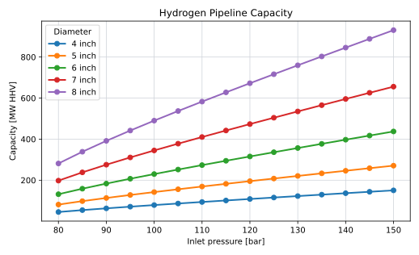
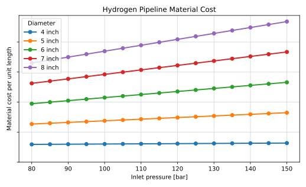
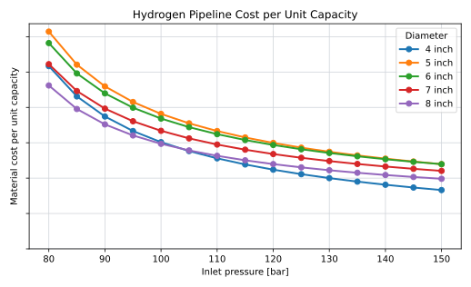

## Role and Scope

Hydrogen pipelines transport compressed hydrogen through the infield collection network and from the wind farm to the onshore hydrogen interface.

The model distinguishes between infield pipelines and export pipelines, but documents them together because the same diameter, pressure, capacity, and material-cost logic applies. The infield topology and length calculation are documented on [Hydrogen Infield Infrastructure](infield_infrastructure.qmd). Installation is excluded from this page and is documented separately in [Cable and Pipeline Installation](../offshore_installation/cable_and_pipeline_installation.qmd).

The pipeline model covers:

- material CAPEX for composite flexible hydrogen pipelines
- transport capacity as a function of diameter, pressure, and route length
- the number of parallel export pipelines required for a wind-farm hydrogen flow
- the coupling between pipeline pressure, compressor duty, and total LCOE

## Composite Flexible Pipelines

Composite flexible pipelines are used as the reference hydrogen pipeline technology in this model. A flexible composite pipe typically combines a hydrogen-compatible liner, load-bearing composite reinforcement, and a protective outer layer. Compared with a rigid steel pipeline, the relevant system-level advantage is not only material substitution. The important offshore feature is that the pipe can be manufactured and transported in long continuous lengths, spooled on a reel, and laid with fewer welded field joints.

This matters for offshore hydrogen infrastructure because the model is concerned with many repeated infield connections and, in the decentralised architecture, a pipeline grid that replaces the AC infield cable network. Flexible composite lines are lighter than steel lines at the diameters considered here, are less exposed to corrosion-related design issues, and can simplify installation logistics. These advantages are especially relevant for infield pipelines and for export pipelines up to the diameter range that remains compatible with reel-lay handling.

The flexibility benefit is not unlimited. Larger diameters and higher pressure classes require more reinforcement and increase minimum bend radius. The source material therefore caps the composite export-pipeline diameter at 8 inch: above this range, the pipeline is assumed to lose the reel-lay flexibility that motivates the technology choice [@internalModelDescription2026].

## Sizing Variables

Pipeline sizing is governed by the variables in @tbl-pipeline-sizing-variables.

| Variable | Role in the model |
|---|---|
| Internal diameter, $D$ | Determines cross-sectional area and strongly affects capacity. |
| Inlet pressure, $p_\mathrm{in}$ | Equal to compressor outlet pressure; an optimisation variable. |
| Outlet pressure, $p_\mathrm{out}$ | Fixed by the required downstream interface pressure. |
| Route length, $L$ | Sets frictional pressure loss for a given flow. |
| Roughness and friction data | Determine the Fanning friction factor used in the capacity equation. |
| Number of parallel pipelines, $n_\mathrm{pipe}$ | Discrete result needed when one pipeline cannot carry the selected peak flow. |

: Main pipeline sizing variables. {#tbl-pipeline-sizing-variables}

For the export pipeline, the current reference case uses an 80 km route length and a 66 bar outlet pressure. The 66 bar value is used because it represents the expected maximum pressure of the Dutch hydrogen backbone, allowing injection without an additional onshore compressor in the base case [@internalModelDescription2026].

## Capacity Model

Pipeline capacity is calculated explicitly from the pressure drop available between the pipeline inlet and outlet. The implemented calculation follows the gas-flow method used in the Transition Accelerator hydrogen pipeline brief [@transitionAcceleratorHydrogenPipelines] and the Colebrook friction-factor treatment in Perry's Chemical Engineers' Handbook [@perrysChemicalEngineersHandbook]. The implementation uses the Fanning-friction convention from Perry's equations rather than the Darcy-Weisbach convention.

The cross-sectional area is:

$$
A = \frac{\pi D^2}{4}
$$

The available pressure drop is:

$$
\Delta p
=
p_\mathrm{in}
-
p_\mathrm{out}
$$

The code evaluates hydrogen density and viscosity at an average pipeline pressure:

$$
p_\mathrm{avg}
=
\frac{2}{3}
\frac{
p_\mathrm{in}^3 - p_\mathrm{out}^3
}{
p_\mathrm{in}^2 - p_\mathrm{out}^2
}
$$

The average density and viscosity are then obtained from CoolProp:

$$
\rho_\mathrm{avg}
=
\rho(T,p_\mathrm{avg})
,
\qquad
\mu_\mathrm{avg}
=
\mu(T,p_\mathrm{avg})
$$

where $T=293 \ \mathrm{K}$ in the current figure builder.

The implementation then evaluates the combined term $\mathrm{Re}\sqrt{f_F}$:

$$
\mathrm{Re}\sqrt{f_F}
=
\frac{D^{3/2}}{\mu_\mathrm{avg}}
\sqrt{
\frac{
\Delta p \rho_\mathrm{avg}
}{
2L
}
}
$$

where $f_F$ is the Fanning friction factor. The Colebrook relation is applied as:

$$
\frac{1}{\sqrt{f_F}}
=
-4
\log_{10}
\left(
\frac{\epsilon}{3.7D}
+
\frac{1.256}{\mathrm{Re}\sqrt{f_F}}
\right)
$$

where $\epsilon=1.5 \cdot 10^{-7} \ \mathrm{m}$ in the current implementation.

The resulting gas velocity is:

$$
v
=
\sqrt{
\frac{
 D \Delta p
}{
2 \rho_\mathrm{avg} L
}
}
\frac{1}{\sqrt{f_F}}
$$

The mass-flow capacity is:

$$
\dot{m}_\mathrm{max}
=
\rho_\mathrm{avg}
A
v
\cdot
3600
$$

where $\dot{m}_\mathrm{max}$ is expressed in kg/h.

The transport capacity is expressed as an HHV-equivalent power:

$$
P_{\mathrm{H_2},\mathrm{HHV}}
=
\dot{m}_\mathrm{max}
\cdot
\frac{
\mathrm{HHV}_\mathrm{H_2}
}{
1000
}
$$

where $\mathrm{HHV}_\mathrm{H_2}=39.4 \ \mathrm{kWh/kg}$ and $P_{\mathrm{H_2},\mathrm{HHV}}$ is in MW when $\dot{m}_\mathrm{max}$ is in kg/h.

@fig-pipeline-capacity shows the resulting capacity curves for the current diameter and pressure range, assuming an 80 km route length and 66 bar outlet pressure.

{#fig-pipeline-capacity}

## Dependence on Pressure and Diameter

Pressure enters the calculation through both the pressure drop, $\Delta p$, and the pressure-dependent hydrogen properties evaluated at $p_\mathrm{avg}$:

$$
\Delta p = p_\mathrm{in} - p_\mathrm{out}
$$

This means that increasing inlet pressure raises capacity nonlinearly, but with diminishing benefit when expressed against the compressor penalty. Higher pressure can allow one pipeline to carry more hydrogen, but the same pressure increase also raises compressor electricity consumption and compressor CAPEX. Pipeline pressure is therefore optimised jointly with the compressor model rather than selected independently.

Diameter has an even stronger effect on capacity. Area scales with $D^2$, while the velocity equation adds a further $\sqrt{D}$ term before friction effects. Ignoring the secondary effect of friction factor, capacity therefore scales approximately as:

$$
\dot{m}_\mathrm{max}
\propto
D^{2.5}
\sqrt{
\Delta p \rho_\mathrm{avg}
}
$$

This explains why larger diameters tend to have lower cost per unit of transport capacity. The economic optimum often prefers the largest feasible composite diameter. However, export pipelines are discrete assets. If one large pipeline is oversized for the required peak flow, reducing pressure may lower compressor cost while retaining enough capacity. Conversely, a higher pressure can be justified if it avoids an additional parallel pipeline.

The export pipeline count is:

$$
n_\mathrm{pipe}
=
\left\lceil
\frac{
\dot{m}_{\mathrm{H_2},\mathrm{peak}}
}{
\dot{m}_\mathrm{max}(D,p_\mathrm{in},p_\mathrm{out},L)
}
\right\rceil
$$

where $\dot{m}_{\mathrm{H_2},\mathrm{peak}}$ is the peak hydrogen flow that must be exported. This discrete ceiling is important: small changes in pressure, diameter, stack sizing, or wind-farm peak production can change the required number of pipelines.

## Material Cost Model

Pipeline material CAPEX is based on confidential supplier quotes for selected combinations of diameter and pressure class [@supplierSPipelineCost]. The model constructs a two-dimensional interpolation surface over diameter and pressure:

$$
c_\mathrm{mat}
=
I(D,p)
$$

where $I(D,p)$ is the interpolated material cost per unit length. Total material cost for a pipeline route is:

$$
C_\mathrm{mat}
=
L
\cdot
c_\mathrm{mat}(D,p)
$$

For multiple parallel export pipelines:

$$
C_{\mathrm{mat},\mathrm{export}}
=
n_\mathrm{pipe}
\cdot
L_\mathrm{export}
\cdot
c_\mathrm{mat}(D,p)
$$

The current cost model covers material cost only. Installation, burial, connection, vessel time, lay-pass grouping and termination work are excluded here and treated in the shared installation section. More than one TCP pipeline per lay pass is not assumed without project-specific evidence.

### Confidentiality Handling

The raw supplier quotes and fitted material-cost surface are confidential. They are used only to parameterise the model and are not reproduced in this encyclopedia page. Figures derived from them show pressure and diameter on their true scale, since those are model inputs, not supplier data. The cost axis is left without tick labels so that only the shape of the cost curves, not the underlying price level, is disclosed.

### Material Cost vs. Pressure

@fig-pipeline-cost-vs-pressure shows pipeline material cost as a function of inlet pressure, for the same diameters used in @fig-pipeline-capacity. Cost increases sharply from one diameter class to the next, which is expected for a larger pipe, but at fixed diameter the increase with pressure is comparatively small. Material cost, in other words, is mainly a diameter decision. It is capacity, not material cost, that responds strongly to pressure, which is why pressure and diameter play such different roles in the trade-off described in [Pipeline Pressure and Capacity](pipeline_pressure_and_capacity.qmd): raising pressure is cheap on the pipe itself, and its real cost shows up at the compressor instead ([Hydrogen Compressor](compressor.qmd)).

{#fig-pipeline-cost-vs-pressure}

### Cost per Unit of Transport Capacity

@fig-pipeline-cost-per-capacity divides the cost curves in @fig-pipeline-cost-vs-pressure by the capacity curves in @fig-pipeline-capacity, giving material cost per unit of transport capacity at each diameter and pressure.

Because capacity scales much more strongly with diameter than material cost does, cost per unit capacity falls as diameter increases. This is the basis for the earlier claim that the economic optimum tends toward the largest feasible composite diameter. The same ratio also falls with pressure, at diminishing rate, for the same reason: on the pipe alone, more pressure buys more capacity for very little extra material cost. This curve reflects material cost only. It does not include the compressor cost and energy penalty that pressure also brings, which is why a pure cost-per-capacity view of the pipeline cannot be used to pick a pressure on its own — see [Pipeline Pressure and Capacity](pipeline_pressure_and_capacity.qmd) for how the compressor side of that trade-off is brought back in.

{#fig-pipeline-cost-per-capacity}

## Current Reference Assumptions

| Parameter | Value |
|---|---:|
| Baseline export length | 80 km |
| Export pipeline outlet pressure | 66 bar |
| Export pipeline inlet pressure | Optimisation variable |
| Typical inlet-pressure range | 80-150 bar |
| Maximum composite pipeline diameter | 8 inch |
| Infield pipeline diameter | 6 inch |
| Infield pipeline pressure | 150 bar |
| Infield pipeline capacity | about 500 MW equivalent (outlet pressure assumption not yet documented; see Model Limitations) |
| Pipeline OPEX | 0.5% of material CAPEX per year |

The infield capacity assumption means that a 6 inch composite pipeline at 150 bar can serve a full row of turbines in the decentralised architecture without the string-capacity constraint that applies to 66 kV AC cables [@internalModelDescription2026].

## Energy Balance

The current model assumes no additional hydrogen losses in the pipelines after compression. Pipeline pressure drop affects required compression pressure and transport capacity, but it is not represented as a direct hydrogen loss term.

## Availability

| Component | Availability |
|---|---:|
| Infield pipelines | 100% |
| Export pipelines | 100% |

This is a modelling convention and should be tested in sensitivity work if pipeline outages become material.

## Model Limitations

The pipeline model is intended for early-stage techno-economic comparison, not detailed pipeline design. The main limitations are:

| Limitation | Implication |
|---|---|
| Cost interpolation is based on confidential quote points | The public documentation can describe the method, but not the numerical surface. |
| Material and installation are separated | This page should not be used as a total installed pipeline cost model. |
| Diameter classes are simplified | Detailed product availability and qualification limits are not represented. |
| Gas properties are simplified | Detailed thermal behaviour, elevation effects, transient operation, and linepack are excluded. |
| Availability is fixed at 100% | Repair strategy, redundancy, and partial-flow operation are not modelled. |
| The outlet-pressure assumption behind the infield capacity figure is not documented | The 500 MW-equivalent figure should be re-derived once the infield collection-point pressure is defined, rather than assumed equal to the 66 bar export outlet pressure. |

: Main limitations of the hydrogen pipeline model.
