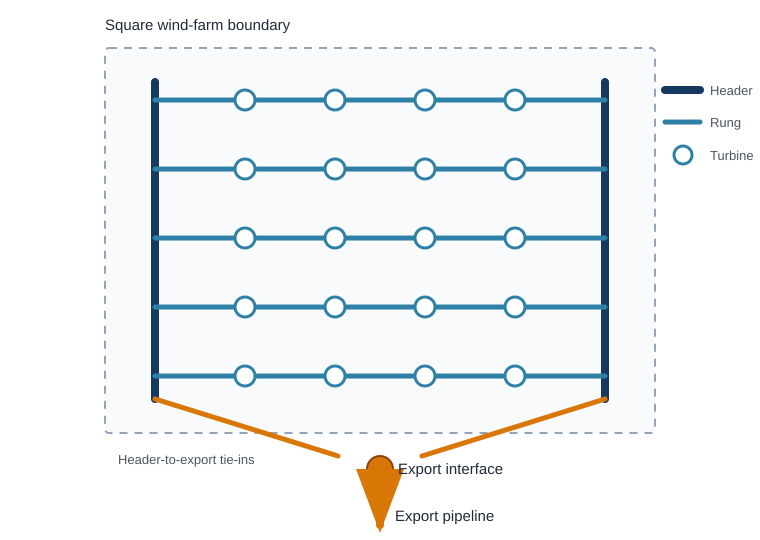

## Role and Scope

Hydrogen infield infrastructure collects compressed hydrogen from turbine-integrated electrolysers and delivers it to the export-pipeline connection. It applies only to the decentralised hydrogen architecture. The electricity-export and centralised-hydrogen architectures use 66 kV AC infield cables.

This page defines the proposed network topology and the analytical pipeline-length model. Pipeline material, pressure and capacity are covered on [Hydrogen Pipelines](hydrogen_pipelines.qmd). Installation is covered on [Pipeline Installation](../offshore_installation/pipeline_installation.qmd).

## Proposed Ladder Layout

The proposed network is a ladder. Two longitudinal header pipelines run along opposite sides of the turbine field. Cross-farm pipelines form the rungs. Turbines connect directly to the rung that passes through their row.

{#fig-hydrogen-infield-ladder}

The layout is used for four reasons:

- A 6 inch composite pipeline at 150 bar is assumed to carry about 500 MW of hydrogen on an HHV-equivalent basis. One rung can therefore collect a complete turbine row without the 60--70 MW string limit of a 66 kV AC cable [@internalModelDescription2026].
- Each turbine can send hydrogen to either header. Isolation of one local rung or header segment does not automatically isolate every turbine behind that segment.
- The regular grid follows the turbine rows and avoids a separate radial route from every turbine to a central platform.
- Flexible composite pipe can be supplied in long reeled lengths. This suits repeated infield runs and reduces the number of offshore field joints relative to rigid steel pipe [@internalModelDescription2026].

The topology provides two **infield** paths, not two independent export systems. Both paths ultimately reach the same export-pipeline interface. Valves, isolation philosophy and the capacity of the remaining path determine whether the redundancy can be used after a fault.

## Pipeline-Length Model

The screening model assumes:

- a square wind-farm area;
- evenly spaced turbines arranged in approximately square rows;
- two headers, each equal to one farm side;
- each rung spans one farm side; and
- the number of rungs is approximated by the square root of turbine count.

For farm area $A_\mathrm{farm}$ in km$^2$, the side length is:

$$
s=\sqrt{A_\mathrm{farm}}.
$$

For $N_\mathrm{turb}$ turbines, the continuous estimate of rung count is:

$$
n_\mathrm{rung}=\sqrt{N_\mathrm{turb}}.
$$

Rung length and header length are:

$$
L_\mathrm{rungs}
=
n_\mathrm{rung}s,
\qquad
L_\mathrm{headers}
=
2s.
$$

The total horizontal infield pipeline length is therefore:

$$
\boxed{
L_\mathrm{infield}
=
\sqrt{A_\mathrm{farm}}
\left(
\sqrt{N_\mathrm{turb}}+2
\right)
}
$$

with $L_\mathrm{infield}$ in km when $A_\mathrm{farm}$ is in km$^2$ [@internalModelDescription2026].

This continuous form is suitable for optimisation. A physical layout requires an integer number of rows. For a conservative square-grid representation, use:

$$
n_\mathrm{rung,int}
=
\left\lceil
\sqrt{N_\mathrm{turb}}
\right\rceil,
\qquad
L_\mathrm{infield,int}
=
\sqrt{A_\mathrm{farm}}
\left(
n_\mathrm{rung,int}+2
\right).
$$

## Reference Calculation

The reference farm has an area of 200 km$^2$ and a nominal capacity of 2 GW. With 15 MW turbines, the required turbine count is:

$$
N_\mathrm{turb}
=
\left\lceil
\frac{2{,}000}{15}
\right\rceil
=
134.
$$

The farm side length and continuous rung estimate are:

$$
s=\sqrt{200}=14.142\ \mathrm{km},
\qquad
n_\mathrm{rung}=\sqrt{134}=11.576.
$$

The modelled pipeline length is:

$$
\begin{aligned}
L_\mathrm{infield}
&=
14.142(11.576+2) \\
&=
\boxed{192.0\ \mathrm{km}}.
\end{aligned}
$$

If the layout is represented with 12 complete rungs:

$$
L_\mathrm{infield,int}
=
14.142(12+2)
=
\boxed{198.0\ \mathrm{km}}.
$$

The optimisation model should use 192.0 km if it retains the continuous approximation. A routed design with 12 physical rows should start from 198.0 km before project-specific adjustments.

## Scope of the Length Result

The calculated length includes the horizontal rungs and the two horizontal headers. It excludes:

- the export pipeline from the farm boundary to shore;
- turbine risers, local tie-ins and short spool pieces;
- the export manifold and header-to-export connections;
- route deviations around seabed constraints, crossings and exclusion zones;
- installation slack and contingency; and
- parallel pipe added where segment capacity is insufficient.

No 20% routing allowance is included in the current hydrogen base case. The source applies that allowance to the analytical AC-cable layout, not to the hydrogen ladder. A separate routing factor may be applied before detailed routing:

$$
L_\mathrm{routed}
=
L_\mathrm{infield}
\left(1+f_\mathrm{route}\right).
$$

Do not apply this factor to a GIS-derived route that already includes deviations and slack.

## Capacity and Redundancy Checks

The length equation defines geometry only. It does not prove that every segment can carry the required flow.

The 500 MW-equivalent assumption supports the claim that one 6 inch rung can serve a turbine row. Header flow is higher because successive rungs add hydrogen. Header diameter, pressure drop and fault-state capacity must therefore be checked segment by segment. The current model does not yet perform this check and should not assume that every header segment can remain 6 inch.

The same limitation applies to redundancy. An alternative route is useful only if isolation valves can separate the failed section and the remaining pipeline path has enough capacity. The present assumption of 100% infield-pipeline availability is a modelling convention, not a reliability result.

## Current Model Inputs

| Parameter | Base case |
|---|---:|
| Architecture | Decentralised hydrogen |
| Topology | Two-header ladder |
| Infield pipeline diameter | 6 inch screening assumption |
| Infield pressure | 150 bar |
| Assumed rung capacity | About 500 MW HHV-equivalent |
| Farm area | 200 km$^2$ |
| Turbine rating | 15 MW |
| Turbine count for nominal 2 GW | 134 |
| Continuous model length | 192.0 km |
| Twelve-rung physical representation | 198.0 km |
| Routing allowance | 0% in the current base case |
