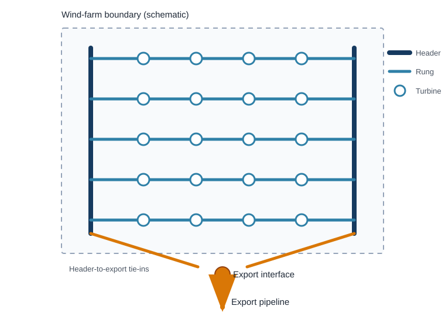

## Role and Scope

Hydrogen infield infrastructure collects compressed hydrogen from turbine-integrated electrolysers and delivers it to the export-pipeline connection. It applies only to the decentralised hydrogen architecture. The electricity-export and centralised-hydrogen architectures use 66 kV AC infield cables.

This page defines the proposed network topology and the analytical pipeline-length model. Pipeline material, pressure and capacity are covered on [Hydrogen Pipelines](hydrogen_pipelines.qmd). Installation is covered on [Cable and Pipeline Installation](../offshore_installation/cable_and_pipeline_installation.qmd).

## Proposed Ladder Layout

The proposed network is a ladder. Two longitudinal header pipelines run along opposite sides of the turbine field. Cross-farm pipelines form the rungs. Turbines connect directly to the rung that passes through their row.

{#fig-hydrogen-infield-ladder}

The layout is used for four reasons:

- A 6 inch composite pipeline at 150 bar is assumed to carry about 500 MW of hydrogen on an HHV-equivalent basis. One rung can therefore collect a complete turbine row without the 60--70 MW string limit of a 66 kV AC cable [@internalModelDescription2026].
- Each turbine can send hydrogen to either header. Isolation of one local rung or header segment does not automatically isolate every turbine behind that segment.
- The regular grid follows the turbine rows and avoids a separate radial route from every turbine to a central platform.
- Flexible composite pipe can be supplied in long reeled lengths. This suits repeated infield runs and reduces the number of offshore field joints relative to rigid steel pipe [@internalModelDescription2026].

The topology provides two **infield** paths, not two independent export systems. Both paths ultimately reach the same export-pipeline interface. Valves, isolation philosophy and the capacity of the remaining path determine whether the redundancy can be used after a fault.

## Ladder Geometry for the Reference Case

The geometry follows the common coordinates of the
[agreed reference case](../research_articles/turbine_level_hydrogen/reference_case.qmd#sec-common-operating-case):
a rectangle of breadth $B$ across the dominant wind and length $L$ along it,
with $n_L$ crosswind rows of up to $n_B$ turbines. Turbine centres span the
rectangle, and the shorter final row is centred.

- **Rungs** follow the crosswind rows. Each rung spans the full breadth between
  the two headers, so its horizontal length is $B$.
- **Headers** run along-wind through the ends of the rows. Each spans from the
  first to the last row, so its horizontal length is $L$.
- **Turbine connections**: every turbine sits on its row's rung. The rung is
  divided into sections between consecutive turbines; in full rows the end
  turbines lie on the headers, while the shorter final row needs one extension
  section at each end to reach them.

The horizontal ladder length, in km, is:

$$
L_\mathrm{ladder}=n_L B+2L.
$$

| Quantity | Value |
|---|---:|
| Rungs $n_L$ |  |
| Rung length $B$ |  km |
| All rungs |  km |
| Header length $L$ |  km |
| Both headers |  km |
| **Ladder total, excluding tie-ins** | ** km** |
| Rung sections (inter-turbine and final-row extensions) |  |
| Header sections (between consecutive rows) |  |

: Ladder geometry for the reference case, calculated by [the reference-case calculation](../research_articles/turbine_level_hydrogen/analysis/reference_case.py).

Orienting the rungs along the crosswind rows gives fewer, longer rungs and
shorter headers than rungs along the columns. The earlier square-farm estimate
($\sqrt{A}(\sqrt{N}+2)$ for 200 km² and 134 turbines, 192–198 km) is superseded
for the article case.

## Manifold Boundary and Tie-ins

Both headers end at the export manifold through tie-in sections, as in
@fig-hydrogen-infield-ladder. The manifold is the boundary between infield
collection and the export pipeline: sections upstream of it belong on this page,
and the export line starts there. **Its location is not yet adopted** (O7, a
joint decision). If it sits between the two header ends on the export-side edge,
as in the schematic, the tie-ins together span about $B$ and run parallel to the
last row's rung; whether that rung could double as a tie-in is a design choice
that changes its duty. Tie-in lengths are therefore excluded from the total
above.

## Model Representation and Healthy-State Flow

The model reads the collection network as explicit sections (see the
[model guide](../model/README.md)): each section has its end nodes, vertical
length, route allowance, healthy-state flow share, true internal diameter and
absolute inlet and outlet pressures. Non-turbine nodes, such as header nodes and
the manifold, are listed separately. Every physical section is included, even
if its healthy-state flow is zero.

The healthy-state allocation used for the reference case is:

- each rung splits at its centre, with half the row flowing to each header;
  in a row with an odd turbine count, the middle turbine sends half its flow each way;
- each header carries its half of the farm toward the export end;
- each tie-in carries one header's flow to the manifold.

At rated output, a full rung therefore delivers 
MW to each header, while each header's export end and each tie-in carry
 MW (HHV-equivalent electrical input;
hydrogen flow follows from the stack model). Section diameters and pressures are
design inputs of each case, examined in the O7 pressure–diameter study; they are
not fixed by the geometry. The section table is generated once the manifold
location is adopted.

## Scope of the Length Result

The calculated length includes the horizontal rungs and the two horizontal headers. It excludes:

- the export pipeline from the farm boundary to shore;
- turbine risers, local tie-ins and short spool pieces;
- the tie-ins and export manifold, whose location is not yet adopted;
- route deviations around seabed constraints, crossings and exclusion zones;
- installation slack and contingency; and
- parallel pipe added where segment capacity is insufficient.

No 20% routing allowance is included in the current hydrogen base case. The source applies that allowance to the analytical AC-cable layout, not to the hydrogen ladder. A separate routing factor may be applied before detailed routing:

$$
L_\mathrm{routed}
=
L_\mathrm{infield}
\left(1+f_\mathrm{route}\right).
$$

Do not apply this factor to a GIS-derived route that already includes deviations and slack.

## Flow and Pressure Checks Versus Redundancy

**Current checks (healthy state).** For the supplied sections and flow shares,
the model conserves flow at every node, checks that each section's capacity
covers its peak flow at the supplied inlet and outlet pressures, and rejects a
pressure rise at a junction without a compressor. The legacy claim that one
6 inch rung at 150 bar carries about 500 MW supports a single row
( MW per rung end). It does not cover the
header ends and tie-ins at  MW each, which
need a larger diameter, parallel pipe or a higher pressure; that choice belongs to
the pressure–diameter study.

**Deferred (D3).** Fault states, isolation valves, rerouting through the second
header and spare capacity are not analysed. The flow allocation above is not
solved as a hydraulic loop network, and the model claims no redundancy benefit.
The 100% infield-pipeline availability is a modelling convention, not a
reliability result.
