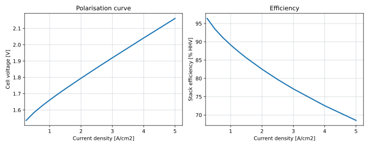

## Role in the Value Chain

The PEM electrolyser stack is the primary energy conversion component of the hydrogen production system.
It converts electrical power and water into hydrogen and oxygen and therefore largely determines the overall efficiency of the electrolyser.

Within this model, the stack is represented explicitly because its efficiency, degradation and sizing have a strong influence on the optimal design of the offshore energy system.
Rather than optimising the stack in isolation, it is evaluated as one component of the complete offshore hydrogen production chain.

PEM stacks are present in both centralised and decentralised hydrogen production architectures.

::: {.callout-note}
## Why PEM?

PEM electrolysis is selected because it is well suited to variable renewable electricity.
The technology can rapidly follow fluctuations in wind power while maintaining high efficiency over a wide operating range.

Another important advantage is that hydrogen is produced at an elevated outlet pressure (approximately 30 bar in the source material), reducing the required downstream compression ratio compared with low-pressure electrolysis technologies.

See the [Compressor page](../hydrogen_infra/compressor.qmd#sec-compressor-pem) for more discussion.
:::

## Stack Model

The stack model consists of four interacting components:

- stack efficiency
- modular operation
- degradation
- cost

Together these determine the optimal installed stack capacity and operating strategy.

## Polarisation Curve

**Engineering principle**

The electrical energy required to produce hydrogen depends on the cell voltage.
As current density increases, the cell voltage rises because activation, ohmic and mass transport losses become larger.
Consequently, stack efficiency decreases at higher current densities.

**Model implementation**

Stack efficiency is calculated from a manufacturer polarisation curve [@manufacturerGStackPolarisation] relating cell voltage to current density.
The operating point is defined as a percentage of the maximum current density (equivalently the maximum stack power).

{#fig-polarisation}

As shown in @fig-polarisation, the optimisation therefore captures the trade-off between operating fewer stacks at high current density or more stacks at lower current density.

## Modularity

Commercial PEM electrolysers are typically manufactured as modular units with capacities of approximately 1 MW.
Larger electrolysers are constructed by combining many identical modules.

The modular approach offers several practical advantages:

- repeatable manufacturing
- manageable electrical voltages and currents
- improved thermal management
- easier transport and installation
- simplified maintenance and replacement

The model therefore represents an electrolyser as a collection of identical stack modules.

## Module Switching

Because the electrolyser is modular, not every stack module has to operate simultaneously.

For every operating point, the model selects the number of active modules that maximises the overall conversion efficiency.
The available electrical power is then distributed across the active modules.

This operational flexibility also alleviates the minimum-load limitation of PEM stacks, which is typically around 10% of the rated module capacity.

For example, a 10 MW electrolyser consisting of ten 1 MW modules can operate at only one active module and 10% load.
The minimum system load therefore becomes approximately 100 kW rather than 1 MW, allowing hydrogen production to continue during periods of low wind generation without operating individual stacks below their safe operating limit.

Module switching is assumed to occur without efficiency or lifetime penalties.

## Stack Overplanting

The modular architecture naturally allows installation of more stack capacity than the maximum available electrical input.
This is referred to here as **stack overplanting**.

Operating a larger installed stack capacity reduces the average current density of each active module.
Lower current density increases conversion efficiency and slows stack degradation.

These benefits come at the expense of additional stack CAPEX.
The model therefore treats the installed stack capacity as an optimisation variable and determines the economically optimal degree of overplanting by minimising the overall LCOE.

In this LCOE optimisation, the system scope greatly influences the outcome.
As the scope expands, the optimum generally shifts towards larger stack capacities and higher efficiencies, as stack costs become a smaller fraction of the total system investment.
See the box below for a worked example.

::: {.callout-note}
## Example: Why the optimisation scope matters

Consider first an electrolyser system consisting only of the power electronics, stacks and balance of plant.

If the stack represents roughly 30% of the total electrolyser cost, increasing the installed stack capacity by 50% increases the overall system CAPEX by approximately 15%.
Such an investment is only justified when the resulting efficiency improvement produces comparable lifetime savings.

Now consider the complete offshore hydrogen production system, including wind turbines, electrical infrastructure, offshore installation and export systems.

Within this larger system the stack may represent only 5% of the total investment
A 50% increase in installed stack capacity therefore increases total project cost by only around 2.5%, making relatively small efficiency improvements economically worthwhile.

This illustrates why component optimisation should always be performed within the context of the complete energy system rather than considering each component independently.
:::

## Degradation

**Efficiency loss**

PEM stacks gradually degrade during operation.
As degradation progresses, the cell voltage increases, reducing the electrical efficiency of hydrogen production.
The model assumes linear degradation with accumulated full-load operating hours at a rate of 0.18% per 1000 full-load hours.

**Stack replacement**

Eventually the efficiency loss becomes sufficiently large that replacing the stack is economically preferable to continued operation.
Rather than prescribing a fixed replacement criterion, the replacement moment is determined through the LCOH optimisation.
In practice, approximately 10% performance degradation is commonly considered end-of-life.

**Effect of partial-load operation**

Operating more installed stack capacity reduces the average current density of each module, slowing degradation and extending stack lifetime.
This creates an additional economic incentive for stack overplanting, alongside the efficiency improvements described previously.

::: {.callout-note}
## Example: Stack overplanting and degradation
Assume a stack is replaced after reaching 10% degradation.
With a degradation rate of 0.18% per 1000 full-load hours, replacement occurs after approximately 58,500 full-load hours.
Assuming an offshore wind capacity factor of 40%, this corresponds to roughly 16.7 calendar years.
A 25-year project therefore requires at least one stack replacement.
If this replacement is already unavoidable, installing additional stack capacity from the outset becomes an attractive alternative.
The total stack material requirement over the project lifetime remains similar, while the system additionally benefits from:

1. Lower maintenance costs by avoiding mid-life replacement.
2. Higher efficiency through operation at lower current density.
3. Reduced degradation throughout the project lifetime.

This conclusion depends strongly on the assumption that degradation scales linearly with accumulated full-load hours.
:::

## Cost Model

**Cost basis**

The stack cost is based on the NREL bottom-up manufactured cost analysis for PEM water electrolyser stacks [@nrelElectrolyserCostBasis]. The NREL study evaluates a 1 MW PEM electrolyser stack and reports stack manufactured costs in 2020 US dollars per kW of stack capacity. The reported stack-only manufactured costs are:

* 316 $/kW at 10 MW/year manufacturing volume
* 183 $/kW at 100 MW/year manufacturing volume
* 164 $/kW at 1,000 MW/year manufacturing volume

These values exclude manufacturer markup, installation costs, soft costs and inflation. They are therefore used here as stack manufacturing cost inputs rather than complete installed electrolyser system costs.

For the base case, the model uses the **1,000 MW/year manufacturing-volume case**, corresponding to a stack manufactured cost of **164 $/kW** in the NREL reference case. This case is selected because the offshore hydrogen system considered here represents industrial-scale deployment rather than early low-volume manufacturing. The 10 MW/year and 100 MW/year cases may be used in sensitivity analysis to represent less mature supply chains or slower manufacturing scale-up.

**Reference-rated stack capacity**

A complication is that the rated power of a PEM stack is not a purely physical property. For a given number of cells and active cell area, stack power depends on the current density at which the stack is rated. A higher rated current density gives more electrical power from the same physical stack and therefore reduces the apparent cost expressed in $/kW or €/MW, even if the stack itself has not become cheaper.

This is important because current density is treated explicitly in this model. Operating at higher current density increases the power output of a given stack, but it also increases cell voltage, reduces efficiency and accelerates degradation. Conversely, installing more stack capacity allows operation at lower current density, improving efficiency and lifetime at the expense of higher CAPEX.

The model therefore uses a **reference-rated stack capacity** as the cost-normalisation convention. This is the electrical capacity the installed stack would have if operated at a fixed reference current density of **3 A/cm²**. The reference-rated capacity is used only for cost accounting; it does not imply that the stack must operate continuously at this current density.

NREL’s cost values are converted to this 3 A/cm² reference-rating convention where necessary. This avoids treating changes in rating current density as independent cost reductions. In the NREL cost-reduction waterfall, part of the reduction in $/kW arises from increased current density, because the same physical stack area is assigned a higher rated power. In this model, that mechanism is already captured explicitly through the polarisation curve: higher current density allows more power from the same installed stack, but with an efficiency and degradation penalty. Therefore, current-density-driven reductions in reported $/kW are not applied as a separate stack cost reduction.

**Model implementation**

The stack is modelled as a modular component whose cost scales linearly with installed reference-rated stack capacity.
Linear scaling is used because larger PEM electrolyser systems are represented as multiple identical stack modules rather than as a single geometrically scaled stack. As a result, increasing installed stack capacity increases the number of modules, cells and active area approximately proportionally. 
No equipment-level scaling exponent is therefore applied to the stack itself.

Actual stack operation is determined separately by the optimisation. 
At each time step, the model chooses the number of active modules and their operating current density. 
The corresponding electrical input, hydrogen production, efficiency and degradation are calculated from the polarisation curve. Reference-rated stack capacity is therefore a bookkeeping convention for cost only, while the physical and operational behaviour of the stack remains governed by current density.

**Cost development**

The main cost reductions for PEM stacks are assumed to come from manufacturing learning, higher production volumes and material reductions rather than from size-based economies of scale at the individual-stack level. 
In the NREL analysis, increasing manufacturing volume from 10 MW/year to 1,000 MW/year reduces the reported stack manufactured cost from 316 $/kW to 164 $/kW.

However, cost reductions associated purely with higher rated current density are treated separately from manufacturing learning. A higher current density reduces the reported $/kW by increasing the rated power per unit active area, but it does not necessarily reduce the physical cost of the installed stack. 
However, in this research, the reference rated stack current density is 3 A/cm2, but NREL uses 2 A/cm2. 
So this cost reduction must be applied as well.

Taking figure 27 as the reference, we apply the increased current density to 3 A/cm2 and economies of scale to 1000 MW/year to find $316-57-132-15=112$ $/kW. 
Consequently, a 50% manufacturers cost mark-up as well as conversion to 2024€ is applied to find: 100 €/kW (CHECK)

**Scope distinction**

Only the stack cost is included in this component model. 
Balance-of-plant equipment, power electronics, installation, offshore structures and other system-level costs are represented elsewhere in the model. 
This distinction is important because the NREL report also provides full electrolyser system costs, but those include balance-of-plant components that are outside the scope of this stack page.

Stack replacement costs are calculated using the same specific stack cost assumption as the initial stack.

## Availability

The modular architecture provides inherent redundancy because individual stack modules can be isolated without shutting down the complete electrolyser.
A stack availability of **99.5%** is assumed throughout this study.

## Installation and Mass

Stack installation is included within the installation model of the complete electrolyser facility or turbine-integrated hydrogen production system.

A dedicated stack mass model is not yet included.
If future work identifies stack mass as a significant driver for tower sizing, platform design or installation costs, this section should be expanded accordingly.
