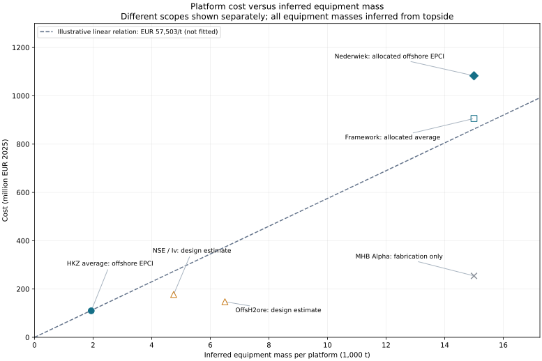

## Calculation and Cost Boundary

This page defines the implemented cost model for **one central offshore platform**: a commercial engineering, procurement, construction and installation (EPCI) package scaled by its complete topside mass. The output is total offshore platform EPCI CAPEX on the common EUR~2025~ basis.

The package includes platform engineering, structural fabrication, yard integration, transport, offshore installation, hook-up and commissioning within the reference contract's scope. These activities enter the project cost total **once**, through this package. A separate platform fabrication or installation estimate must not be added to it.

Hosted process and conversion equipment purchase remains with the component owners. Its mass drives platform sizing, but its purchase cost must be excluded from the platform benchmark before comparison. Cables, pipelines and their installation remain separate. Contract-level engineering and delivery allowances already embedded in EPCI must not be added again as project-wide allowances. Other owner costs remain outside this package.

::: {.callout-note}
## Implemented commercial screening model

The executable central-platform workflow now books one combined offshore EPCI cost. It accepts complete topside mass; it does not add DNV fabrication, yard-integration or platform-installation costs. The benchmark coefficient is an adopted screening judgement, not a fitted law. Previous models remain in the non-published archive and as inactive comparison helpers.

Platform CAPEX can be calculated independently of unresolved OPEX and decommissioning. Complete LCOH remains unavailable until all included cost inputs are supplied. Installation feasibility is reported as not assessed by this mass-cost calculation.
:::

## Why Use the Combined Commercial Package?

Commercial awards provide observable prices for delivered packages, but generally do not disclose a consistent split between platform materials, fabrication, integration and offshore installation. A detailed calculation of those components would require independently supported rates, durations, equipment inclusions and commercial allowances. The available evidence does not constrain that decomposition sufficiently.

For this model, fabrication and installation are procured as one delivered offshore EPCI scope. Their separation is unnecessary for the required total **if their material cost drivers can be represented together**. Our working hypothesis is that complete topside mass represents the associated fabrication, integration and installation effort, making total EPCI approximately proportional to complete topside mass over a comparable design range.

This is a modelling hypothesis, not an established scaling law. Fixed mobilisation costs, site conditions and changes in installation method can break proportionality. Combining scopes does not prove that each component scales linearly; the total relationship must be tested against additional commercial references. Until then, an aggregate relationship is more transparent than a detailed breakdown built from poorly constrained assumptions.

## Mass Basis and Cost Relationship

The upstream [Complete Topside Mass](topside_mass.qmd) calculation supplies $M_{\mathrm{top}}$ in tonnes, including hosted equipment, auxiliaries and topside structure, but excluding jacket and piles. The cost driver is used directly; no structural-fraction conversion is required.

$$
C_{\mathrm{EPCI}}=C_{\mathrm{ref}}
\left(\frac{M_{\mathrm{top}}}{M_{\mathrm{top,ref}}}\right)^\beta,
\qquad C_{\mathrm{ref}}=k_{2025}M_{\mathrm{top,ref}}.
$$

$C_{\mathrm{EPCI}}$ and $C_{\mathrm{ref}}$ are offshore EPCI costs in EUR~2025~; $k_{2025}$ is EUR~2025~/complete topside tonne; $\beta$ is a dimensionless cost exponent. The default $\beta=$ is a modelling assumption, not a fit. Changing it preserves cost at the reference mass. The mass-to-power exponent on the upstream page is a separate assumption.

The normalisation mass is Alpha's  complete topside [@mhb2023AlphaAward]. Its fabrication subcontract price is **not** the reference EPCI cost. Instead, the adopted coefficient below gives a derived reference cost of ** million EUR~2025~**. Jacket and foundation delivery are included in the cost boundary even though their masses are not added to the topside driver.

## Commercial Benchmarks and Reproducible Comparison

The evidence separates **offshore EPCI awards**, **allocated framework costs**, **hydrogen design studies**, and **fabrication subcontracts**. Only observations with comparable scope can calibrate the same cost relation. Published awards are historical contract values, not verified final outturn costs or current supplier quotations.

For a source cost $C_y$ in currency CU, annual-average exchange rate $X_y$ in CU/EUR, and annual euro-area HICP change $\pi_j$, the preliminary normalisation is

$$
C_{2025}=\frac{C_y}{X_y}\prod_{j=y+1}^{2025}(1+\pi_j).
$$

For EUR-denominated evidence, $X_y=1$. Where a price year is not stated, the award or publication year is an explicit assumption. This adjustment does not capture sector-specific escalation, contractual indexation, final settlement or changes in scope.

For each reference, specific costs and mass intensity follow as

$$
k=\frac{C_{2025}}{M_{\mathrm{top}}},\qquad
c_P=\frac{C_{2025}}{10^6P_{\mathrm{GW}}},\qquad
m_P=\frac{M_{\mathrm{top}}}{10^6P_{\mathrm{GW}}}.
$$

Here $k$ is EUR~2025~/topside tonne, $c_P$ is EUR~2025~/kW and $m_P$ is topside t/kW. The factor $10^6$ converts GW to kW. These are comparison ratios, not additional additive costs.



{#fig-platform-benchmarks fig-alt="Platform cost versus complete topside mass. HVAC offshore EPCI and allocated HVDC EPCI lie above hydrogen design estimates and the fabrication-only subcontract. Framework and project awards overlap and are not independent samples."}

### Interpretation and Tradeoffs

**The commercial observations support investigating linear scaling.** HKZ gives  EUR~2025~/topside t; the individual Nederwiek award, with the assumed offshore allocation, gives  EUR~2025~/topside t. This is a useful cross-check across different masses, but there are only two distinct commercial mass levels. The framework average does not supply a third independent mass level, and its projects need not have equal prices.

Nederwiek's disclosed Petrofac award is preferable to assigning every project the framework average. Its remaining weakness is the offshore/onshore allocation. HKZ avoids that allocation but differs in technology, site and contract date. The owner-procurement description supports excluding major high-voltage equipment from HKZ's platform package; detailed auxiliary-equipment boundaries still require reconciliation [@tennet2021OwnerEquipment].

**The hydrogen estimates remain lower even though installation is included.** The difference therefore cannot be explained solely by missing offshore installation. OffsH2ore also carries a separate  engineering allowance covering several activities, so its structure subtotal is not a complete commercial EPCI quote [@offsh2ore2023Report, sec. 6.2.8]. It would be misleading to apply that whole-plant allowance only to the structural subtotal and call the result scope-matched. Design maturity, equipment boundaries, site, market conditions and commercial risk may explain part of the gap; the evidence does not quantify each contribution. No matched commercial electrolyser-platform EPCI award was identified in this research.

**Complete topside mass removes an unsupported conversion.** Published weights include structure and equipment; there is no need to infer an equipment-only mass. This does not remove differences in equipment density, design maturity or process scope between HVDC and electrolysis. The upstream mass page documents the reference boundaries.

The combined package also hides fixed mobilisation costs and changes in lifting method, foundation type and water depth. Those remain applicability checks. An aggregate model is justified by the lack of defensible separate rates, not by proof that every underlying activity scales linearly.

### Provisional Conclusion and Further Evidence

Retain $\beta=$ as the initial hypothesis. A rounded commercial comparison range is **– EUR~2025~/topside t**. This is the earlier EUR~2023~ screening range converted to the site's price basis; it is not a confidence interval, an exhaustive market range or a validated electrolyser-platform range. The dashed line uses its lower endpoint only to make the mass comparison visible.

The adopted central coefficient is ** EUR~2025~/topside t**, a modelling judgement within that range, not a fitted estimate. Its source-basis input is `platform-epci-topside-unit-cost-source` =  on the EUR~2023~ basis; the normalisation above derives the EUR~2025~ value. Lower and upper screening assumptions remain sensitivity comparisons, not confidence limits. A change to the coefficient must retain its currency year and scope.

The intended mapping is one complete-topside-mass input to one offshore EPCI output, with equipment purchase charged elsewhere. A free fitted exponent is not justified yet: it would confound mass with technology, commercial scope and the assumed offshore allocation. Sensitivity to the reference coefficient, reference mass and allocation is more informative at this stage.

Additional leads remain outside the fit: DolWin beta has a published EPC scope, but its installation boundary needs reconciliation [@aibelDolwinBeta]; RTE's Normandy–Oleron package combines offshore platforms and onshore converter stations [@rte2024HVDCFacts]; RTE Dunkerque needs a matched mass and equipment-purchase boundary [@rte2024Dunkerque]. Oil-and-gas topside EPC packages require similar equipment and foundation boundary checks before transfer. Do not turn partial evidence into an EPCI point by assuming away the missing scope.

For future observations, retain capacity, measured and inferred masses, support structure, depth, installation method, award and price years, currency, equipment inclusions and cost allocation. Do not count parent awards and their subcontracts independently. Keep design studies as a separate comparison class. The highest-value additions are independently scoped offshore EPCI awards at intermediate masses and scope-matched complete topside weights.

## Why the DNV Structural Model Is Not the Total-Cost Model {#worked-example}

The earlier method estimated topside structural mass, jacket mass and pile mass, then multiplied each by a fabrication rate. DNV's reference rates are ,  and , respectively [@dnv2023OffshoreHydrogen, sec. 3.4]. Yard integration and offshore installation would then have been added separately.

The earlier screening comparison placed this structural estimate substantially below the commercial offshore EPCI benchmark. The discrepancy persists after separating Hitachi's converter scope and assigning only the agreed offshore share of Petrofac's package. MHB's broader fabrication subcontract also exceeds the structural estimate. These comparisons show that a structural fabrication calculation cannot stand in for the cost of delivering the platform.

The scopes differ, so this is not evidence that DNV's steel-cost calculation is intrinsically wrong. It shows that the unmodelled delivery scope is material and cannot be reconstructed reliably from the available separate assumptions. We therefore select commercial EPCI as the total-cost basis. The unexplained difference is not assigned wholly to installation or yard integration, and the DNV subtotal is not added to the commercial estimate.

The full previous equations, inputs and code are preserved outside the published site. They remain useful for physical checks and for revisiting the decomposition if better evidence becomes available.

## Executable Interface, Output and Applicability

The model returns one offshore platform EPCI cost, together with its reference scope, mass basis, coefficient, reference mass and scaling exponent. Equipment purchase remains separately accounted for. [Platform Installation](../offshore_installation/platform_and_substation_installation.qmd) explains why no separate platform installation cost is added.

Mass scaling does not establish installation feasibility. Large changes in topside size, foundation type, water depth or installation method may require a different reference class rather than smooth extrapolation. Water depth is initially an applicability condition; no unsupported depth correction is embedded in the total EPCI relationship. Transferring an HVDC-derived relationship to electrolysis remains a hypothesis to test.

Supply `[platform] topside_mass_t` in tonnes. Equipment-only mass is rejected. Alternatively, use `mass_method = "power_scaling"` and `mass_reference = "electrolysis"`; the workflow derives installed DC rating from wind-farm capacity, overplanting and whole stack modules. No separate rating is supplied. The `"hvdc"` and `"custom"` branches retain `rated_power_gw`; the upstream page defines those rating boundaries. A `"custom"` reference requires `platform-reference-topside-mass` and `platform-reference-power`. Supplying direct mass and power scaling together is rejected. Platform count remains one, including extrapolated cases.

The renamed coefficient `platform-epci-topside-unit-cost-source` makes the changed denominator explicit. Its source value is half the earlier equipment-tonne coefficient, preserving the calibration under the former equal equipment/structure split. This is an algebraic rebasing, not new cost evidence; the structural fraction is no longer an active cost input. The screening endpoints were rebased in the same way. Recorded coefficient and exponent overrides retain their price basis and cost boundary.

`physical.platform_costs` reports the calculation and `physical.platform_total_eur` reports its total. The ledger contains one `platform / epci` entry. A separate platform supply or installation entry alongside EPCI is rejected. The calculation requires neither a crane selection nor jacket and pile mass estimates. Any supplied depth is retained as applicability metadata; the workflow does not certify a lift plan.

Annual platform OPEX uses `platform-opex-rate` on the combined platform EPCI total. This rate remains unresolved and must be calibrated for that cost boundary. Hosted equipment retains its own purchase and OPEX entries.

**Decommissioning is separate from EPCI.** The old installation-based proxy cannot recover platform removal cost from the combined package. `platform-decommissioning-cost` is therefore a separate, initially unresolved EUR~2025~ input. It enters lifetime costs once and does not reduce or block the calculated platform CAPEX. Missing decommissioning blocks complete LCOH. The existing installation-based proxy still applies to separately costed non-platform installation [see financial treatment](../methodology/financial_and_price_basis.qmd#decommissioning).

**Remaining evidence work:** expand the commercial sample, obtain matched complete topside weights, reconcile auxiliary-equipment scope, and provide platform OPEX and decommissioning inputs. These gaps do not justify inventing a mass or reporting an incomplete lifetime cost as complete.
